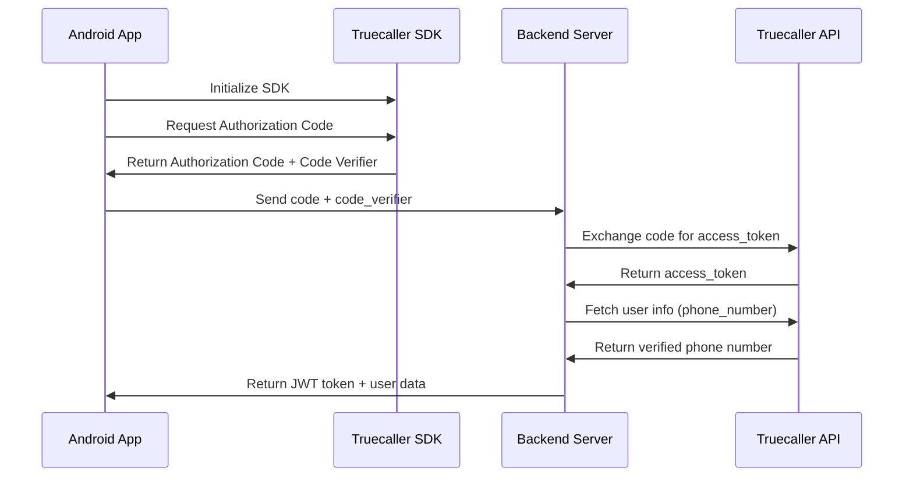

# Truecaller Integration Documentation

## Overview

This documentation provides a complete guide for integrating Truecaller authentication in both Android app and backend. The integration uses OAuth 2.0 flow with PKCE (Proof Key for Code Exchange) for secure authentication.

## Required Credentials

Before starting the integration, you need to obtain the following credentials from Truecaller Developer Portal:

### 1. Truecaller Client ID
- **What it is**: Unique identifier for your application registered with Truecaller
- **Where to get it**: 
  1. Register at [Truecaller Developer Portal](https://developer.truecaller.com/)
  2. Create a new application
  3. Copy the Client ID from your app dashboard
- **Format**: Alphanumeric string (e.g., `8avjby8rduvi2o3kgk6eorcdq457spxayqyse-luibo`)
- **Where to use**:
  - **Android App**: Store in `res/values/strings.xml` as `@string/clientID`
  - **Backend**: Use in token exchange API call to Truecaller
- **Important**: The same Client ID must be used in both Android app and backend

### 2. App Package Name
- **What it is**: Your Android app's package name (e.g., `com.gmwapp.hima`)
- **Where to find**: In your `app/build.gradle.kts` under `applicationId`
- **Where to configure**: Truecaller Developer Portal → App Settings → Package Name

### 3. SHA-256 Fingerprint
- **What it is**: Cryptographic fingerprint of your app's signing certificate
- **Why needed**: Truecaller uses this to verify your app's authenticity
- **How to generate**:
  - **Debug keystore** (for testing):
    ```bash
    keytool -list -v -keystore ~/.android/debug.keystore -alias androiddebugkey -storepass android -keypass android
    ```
  - **Release keystore** (for production):
    ```bash
    keytool -list -v -keystore your-release-key.jks -alias your-key-alias
    ```
- **Where to configure**: Truecaller Developer Portal → App Settings → SHA-256 Fingerprint
- **Important**: 
  - Add both debug and release fingerprints for testing and production
  - Update fingerprint if you change your signing certificate

### 4. App Signature Hash (Optional but Recommended)
- **What it is**: Hash derived from your app's package name and signing certificate
- **Purpose**: Additional security verification
- **How to get**: Truecaller SDK provides helper class `AppSignatureHashHelper` to retrieve it
- **Note**: This is automatically calculated by Truecaller SDK, but you may need to add it to your Truecaller Developer Portal

### Summary Checklist

Before proceeding with integration, ensure you have:

- [ ] Truecaller Developer Account created
- [ ] Application registered in Truecaller Developer Portal
- [ ] Client ID copied and saved securely
- [ ] Package name configured in Truecaller Developer Portal
- [ ] SHA-256 fingerprint(s) generated and added to Truecaller Developer Portal
  - [ ] Debug keystore fingerprint (for development/testing)
  - [ ] Release keystore fingerprint (for production)

### Where to Configure Credentials

1. **Truecaller Developer Portal**: https://developer.truecaller.com/
   - Login → Dashboard → Your App → Settings
   - Configure Package Name, SHA-256 Fingerprint, and other app details

2. **Android App Configuration**:
   - Client ID: `app/src/main/res/values/strings.xml`
   - Package Name: `app/build.gradle.kts` (applicationId)

3. **Backend Configuration**:
   - Client ID: Hardcode in `AuthController.php` or use environment variable

## Architecture Flow



## Prerequisites

### Android App Requirements

- Android Studio
- Minimum SDK: 26
- Target SDK: 35
- Kotlin support
- Truecaller app installed on device (for testing)

### Backend Requirements

- PHP 7.4+ / Laravel
- HTTP client library (Guzzle/HTTP)
- JWT authentication setup

### Truecaller Developer Account

- Register at [Truecaller Developer Portal](https://developer.truecaller.com/)
- Create an app and get Client ID (see Required Credentials section above)
- Configure app package name and SHA-256 fingerprint (see Required Credentials section above)

## Android App Integration

### Step 1: Add Dependencies

In `app/build.gradle.kts`:

```kotlin
dependencies {
    // Truecaller SDK
    implementation("com.truecaller.android.sdk:truecaller-sdk:3.0.0")
}
```

### Step 2: Configure AndroidManifest.xml

Add Truecaller Client ID in `AndroidManifest.xml`:

```xml
<meta-data
    android:name="com.truecaller.android.sdk.ClientId"
    android:value="@string/clientID" />
```

Add Client ID in `res/values/strings.xml`:

```xml
<string name="clientID">YOUR_TRUECALLER_CLIENT_ID</string>
```

### Step 3: Initialize Truecaller SDK

In your login activity (e.g., `NewLoginActivity.kt`):

```kotlin
import com.truecaller.android.sdk.oAuth.*

// Initialize SDK in onCreate
val tcSdkOptions = TcSdkOptions.Builder(this, tcOAuthCallback)
    .sdkOptions(TcSdkOptions.OPTION_VERIFY_ALL_USERS)
    .build()

lifecycleScope.launch {
    withContext(Dispatchers.IO) {
        TcSdk.init(tcSdkOptions)
    }
    
    withContext(Dispatchers.Main) {
        if (TcSdk.getInstance().isOAuthFlowUsable) {
            // Generate PKCE parameters
            val stateRequested = BigInteger(130, SecureRandom()).toString(32)
            val codeVerifier = CodeVerifierUtil.generateRandomCodeVerifier()
            val codeChallenge = CodeVerifierUtil.getCodeChallenge(codeVerifier)
            
            // Store code_verifier for later use
            truecallerCodeVerifier = codeVerifier
            
            // Configure OAuth parameters
            TcSdk.getInstance().setOAuthState(stateRequested)
            codeChallenge?.let { TcSdk.getInstance().setCodeChallenge(it) }
            TcSdk.getInstance().setOAuthScopes(arrayOf("openid", "phone"))
            
            // Request authorization code
            TcSdk.getInstance().getAuthorizationCode(this@NewLoginActivity)
        }
    }
}
```

### Step 4: Handle OAuth Callback

```kotlin
private val tcOAuthCallback = object : TcOAuthCallback {
    override fun onSuccess(tcOAuthData: TcOAuthData) {
        val code = tcOAuthData.authorizationCode
        val codeVerifier = truecallerCodeVerifier // Stored earlier
        
        // Send to backend
        loginViewModel.login("0", code, codeVerifier)
    }
    
    override fun onVerificationRequired(tcOAuthError: TcOAuthError?) {
        // Fallback to manual phone input
        showPhoneInputDialogForTruecallerFallback()
    }
    
    override fun onFailure(tcOAuthError: TcOAuthError) {
        Toast.makeText(this, "Error: ${tcOAuthError.errorMessage}", Toast.LENGTH_LONG).show()
    }
}
```

### Step 5: Handle Activity Result

```kotlin
override fun onActivityResult(requestCode: Int, resultCode: Int, data: Intent?) {
    super.onActivityResult(requestCode, resultCode, data)
    if (requestCode == TcSdk.SHARE_PROFILE_REQUEST_CODE) {
        TcSdk.getInstance().onActivityResultObtained(this, requestCode, resultCode, data)
    }
}
```

### Step 6: API Call to Backend

In `ApiManager.kt`:

```kotlin
fun login(
    mobile: String,
    code: String,
    code_verifier: String,
    callback: NetworkCallback<LoginResponse>
) {
    val apiCall: Call<LoginResponse> = getApiInterface().login(mobile, code, code_verifier)
    apiCall.enqueue(callback)
}
```

In `ApiInterface`:

```kotlin
@FormUrlEncoded
@POST("login")
fun login(
    @Field("mobile") mobile: String,
    @Field("code") code: String,
    @Field("code_verifier") code_verifier: String
): Call<LoginResponse>
```

## Backend Integration

### Step 1: API Endpoint Setup

In Laravel `routes/api.php`:

```php
Route::post('/login', [AuthController::class, 'login']);
```

### Step 2: Login Method Implementation

In `app/Http/Controllers/AuthController.php`:

```php
public function login(Request $request)
{
    $code = $request->input('code');
    $codeVerified = $request->input('code_verifier');
    $mobile = $request->input('mobile');
    
    // Truecaller flow
    if ((empty($mobile) || $mobile == '0') && $code && $codeVerified) {
        // Step 1: Exchange authorization code for access token
        $tokenResponse = Http::withHeaders([
            'Content-Type' => 'application/x-www-form-urlencoded',
        ])->asForm()->post('https://oauth-account-noneu.truecaller.com/v1/token', [
            'grant_type' => 'authorization_code',
            'client_id' => 'YOUR_TRUECALLER_CLIENT_ID',
            'code' => $code,
            'code_verifier' => $codeVerified,
        ]);
        
        if (!$tokenResponse->successful() || !isset($tokenResponse['access_token'])) {
            return response()->json([
                'success' => false,
                'message' => 'Failed to retrieve access token from Truecaller.',
            ], 400);
        }
        
        $accessToken = $tokenResponse['access_token'];
        
        // Step 2: Fetch user info
        $userInfoResponse = Http::withToken($accessToken)
            ->get('https://oauth-account-noneu.truecaller.com/v1/userinfo');
        
        if (!$userInfoResponse->successful()) {
            return response()->json([
                'success' => false,
                'message' => 'Failed to fetch user info from Truecaller.',
            ], 400);
        }
        
        $truecallerData = $userInfoResponse->json();
        $truecallerMobileRaw = $truecallerData['phone_number'] ?? null;
        $isVerified = $truecallerData['phone_number_verified'] ?? false;
        
        if (!$isVerified || !$truecallerMobileRaw) {
            return response()->json([
                'success' => false,
                'message' => 'Mobile number verification via Truecaller failed.',
            ], 403);
        }
        
        // Sanitize phone number (remove +91 prefix)
        $truecallerMobileRaw = ltrim($truecallerMobileRaw, '+');
        if (Str::startsWith($truecallerMobileRaw, '91') && strlen($truecallerMobileRaw) > 10) {
            $mobile = substr($truecallerMobileRaw, 2);
        } else {
            $mobile = $truecallerMobileRaw;
        }
        
        // Validate 10-digit mobile
        if (!preg_match('/^[0-9]{10}$/', $mobile)) {
            return response()->json([
                'success' => false,
                'message' => 'Invalid mobile number format.',
            ], 400);
        }
    }
    
    // Continue with normal login flow using $mobile
    $users = Users::where('mobile', $mobile)->first();
    
    if (!$users) {
        return response()->json([
            'success' => true,
            'registered' => false,
            'usernumber' => $mobile,
        ], 200);
    }
    
    // Generate JWT token
    $token = auth('api')->login($users);
    
    return response()->json([
        'success' => true,
        'registered' => true,
        'token' => $token,
        'data' => $users,
    ], 200);
}
```

## Configuration

### Truecaller Client ID

- **Android**: Store in `res/values/strings.xml` as `@string/clientID`
- **Backend**: Hardcode in AuthController or use environment variable

### Truecaller API Endpoints

- **Token Exchange**: `https://oauth-account-noneu.truecaller.com/v1/token`
- **User Info**: `https://oauth-account-noneu.truecaller.com/v1/userinfo`

### Required Scopes

- `openid`: Required for OAuth flow
- `phone`: Required to get phone number

## Testing

### Test Scenarios

1. **Successful Login**: User with Truecaller app installed
2. **Fallback Flow**: User without Truecaller app (should show phone input)
3. **Invalid Code**: Test with expired/invalid authorization code
4. **Network Errors**: Test with no internet connection

### Debugging

- Check logs for authorization code and code_verifier
- Verify Truecaller API responses
- Ensure Client ID matches in both app and backend

## Troubleshooting

### Common Issues

1. **"Truecaller not usable"**

   - Ensure Truecaller app is installed
   - Check SDK initialization

2. **"Failed to retrieve access token"**

   - Verify Client ID matches
   - Check code_verifier is sent correctly
   - Ensure authorization code hasn't expired

3. **"Mobile number verification failed"**

   - Check phone_number_verified flag in response
   - Verify phone number format

4. **SHA-256 Fingerprint Mismatch**

   - Update fingerprint in Truecaller Developer Portal
   - Use release keystore fingerprint for production

## Security Considerations

1. **Never expose Client ID** in client-side code (consider using ProGuard/R8)
2. **Validate phone numbers** on backend before using
3. **Store code_verifier securely** (don't log it)
4. **Use HTTPS** for all API calls
5. **Implement rate limiting** on backend endpoints

## Files Modified

### Android App

- `app/build.gradle.kts` - SDK dependency
- `app/src/main/AndroidManifest.xml` - Client ID meta-data
- `app/src/main/res/values/strings.xml` - Client ID string
- `app/src/main/java/.../activities/NewLoginActivity.kt` - SDK integration
- `app/src/main/java/.../retrofit/ApiManager.kt` - API call
- `app/src/main/java/.../retrofit/ApiInterface.kt` - Endpoint definition

### Backend

- `app/Http/Controllers/AuthController.php` - Login method with Truecaller flow
- `routes/api.php` - Login route (if not already present)

## Additional Resources

- [Truecaller Developer Documentation](https://developer.truecaller.com/)
- [Truecaller SDK GitHub](https://github.com/truecaller/android-sdk)
- [OAuth 2.0 PKCE Flow](https://oauth.net/2/pkce/)